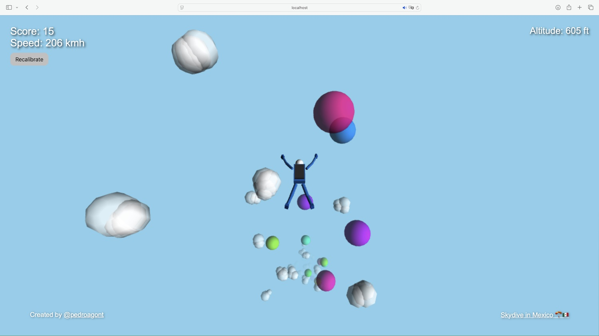

# 🪂 Skydrop Collector  

A **fun 3D browser game** built with [Three.js](https://threejs.org/) where you skydive from 17,000 ft and try to collect balloons to get the highest score possible.  

Play with **WASD/Arrow keys on desktop** or **tilt controls on mobile** for an immersive freefall experience.  

> 🕹️ [Playable Demo](https://skydrop-collector.onrender.com)



---

## 🎮 Gameplay  

- Start at **17,000 ft altitude** and descend through the sky.  
- **Collect balloons** for points while avoiding missing too many.  
- Watch the **altitude and speed meter** as you fall.  
- At the end, your **final score & collected orbs** are displayed.  

---

## ✨ Features:  
- Responsive controls (desktop + mobile tilt).  
- Immersive **3D sky, clouds, and orbs**.  
- Background music + sound effects (start, orb collection, finish).  
- Smooth animations with particle effects when collecting orbs.  

---

## 🕹️ Controls  

**Desktop:**  
- Move with **WASD** or **Arrow Keys**  

**Mobile:**  
- **Tilt your device** to control direction  

---

## 🚀 Tech Stack  

- **Three.js** (3D rendering)  
- **HTML5 / CSS3 / JavaScript**  
- **DeviceOrientation API** (mobile controls)  
- **Web Audio API** (background music + sound effects)  

---

## 📂 Project Structure  

```
📦 Skydiving-Orb-Collector
 ┣ 📜 index.html        # Main game file
 ┣ 📂 audio             # Background & effect sounds
 ┃ ┣ background.mp3
 ┃ ┣ finish.mp3
 ┃ ┗ orb.mp3
```

---

## ▶️ How to Play Locally  

1. Clone this repo:  
   *git clone https://github.com/pedroagont/skydiving-orb-collector.git*  

2. Open `index.html` in your browser.  

3. (Optional) Use a local server for best performance:  
   ```
   npx serve
   ```  
   Then open [http://localhost:3000](http://localhost:3000).  

---

## 🎵 Audio Credits  

You can grab free background music & sound effects from:  
- [Pixabay Free Music](https://pixabay.com/music/)  
- [Youtube Audio Library](https://www.youtube.com/audiolibrary)  

---

## 🏆 Future Enhancements  

- Multiplayer skydiving races.  
- Leaderboard with high scores.  
- VR headset support.  

---

## 📝 License

This project is open source and available under the MIT License.